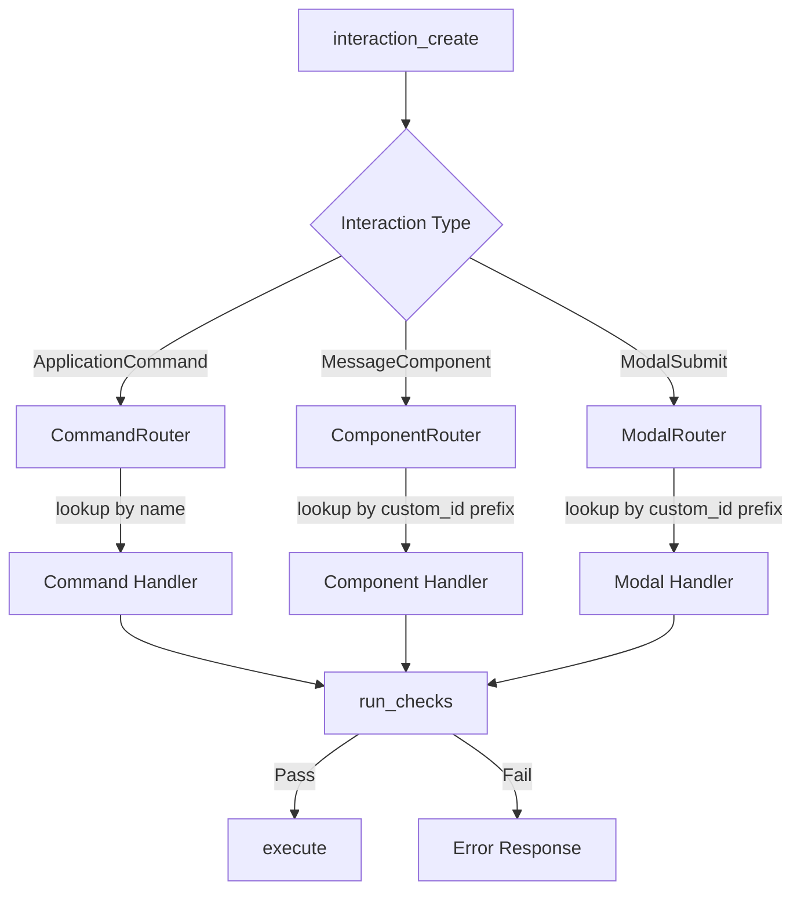

# Interaction System Architecture

## Core Design



Each router receives its specific serenity interaction type and has its own registry - no naming collisions possible.

## Key Components

### 1. Responder Trait

Unified interface for responding to any interaction type. Both `CommandInteraction` and `ComponentInteraction` implement this, allowing components to be invoked from commands directly:

```rust
#[async_trait]
pub trait Responder: Send + Sync {
    async fn respond(&self, http: &Http, response: CreateReply) -> ResponseResult<()>;
    async fn defer(&self, http: &Http, ephemeral: bool) -> ResponseResult<()>;
    async fn edit(&self, http: &Http, response: EditReply) -> ResponseResult<()>;
}

impl Responder for CommandInteraction { /* ... */ }
impl Responder for ComponentInteraction { /* ... */ }
impl Responder for ModalInteraction { /* ... */ }
```

### 2. Interaction Traits

```rust
/// Base trait shared by all interaction types
pub trait InteractionHandler: Send + Sync {
    fn id(&self) -> &'static str;
    fn permission(&self) -> Option<Permission>;
}

/// Slash commands
#[async_trait]
pub trait Command: InteractionHandler {
    fn register(&self) -> CreateCommand;
    async fn execute(&self, ctx: Context, interaction: &CommandInteraction) -> ResponseResult<()>;
}
```

### 3. Typed Component Pattern (the magic)

Developers implement `Component` with a typed `State`. The blanket impl creates `RawComponent` automatically for dyn-compatible storage:

```rust
/// What developers implement - fully typed, ergonomic
#[async_trait]
pub trait Component: InteractionHandler {
    type State: DeserializeOwned + Send;

    async fn execute(
        &self,
        ctx: Context,
        interaction: &dyn Responder,  // Can be CommandInteraction OR ComponentInteraction
        state: Self::State,
    ) -> ResponseResult<()>;
}

/// What gets stored in registry - dyn compatible (developers never see this)
#[async_trait]
pub trait RawComponent: InteractionHandler {
    async fn execute_raw(
        &self,
        ctx: Context,
        interaction: &dyn Responder,
        state: serde_json::Value,
    ) -> ResponseResult<()>;
}

/// Blanket impl - automatic deserialization
#[async_trait]
impl<T: Component + Sync> RawComponent for T {
    async fn execute_raw(
        &self,
        ctx: Context,
        interaction: &dyn Responder,
        state: serde_json::Value,
    ) -> ResponseResult<()> {
        let typed_state: T::State = serde_json::from_value(state)?;
        self.execute(ctx, interaction, typed_state).await
    }
}
```

Same pattern for `Modal` / `RawModal`.

### 4. Type-Safe IDs

Each handler defines its ID as a `const` - no string literals scattered around:

```rust
pub struct ConfigCommand;
impl ConfigCommand {
    pub const ID: &'static str = "config";
}

pub struct ConfigComponent;
impl ConfigComponent {
    pub const ID: &'static str = "config";  // Same ID OK - separate registries
}

// When creating buttons, reference the const - compile-time checked:
CreateButton::new(format!("{}:{}", ConfigComponent::ID, state_uuid))
// If ConfigComponent is renamed/removed, this fails to compile ✓
```

### 5. Commands Invoking Components Directly

Because components take `&dyn Responder`, commands can invoke them directly (CommandInteraction implements Responder):

```rust
#[derive(Serialize, Deserialize)]
struct ConfigState {
    section: String,
}

impl Component for ConfigComponent {
    type State = ConfigState;

    async fn execute(
        &self,
        ctx: Context,
        interaction: &dyn Responder,
        state: ConfigState,  // Already deserialized!
    ) -> ResponseResult<()> {
        // Render config for state.section
        // Works whether called from command or button click
    }
}

impl Command for ConfigCommand {
    async fn execute(&self, ctx: Context, interaction: &CommandInteraction) -> ResponseResult<()> {
        let section = /* parse from command options */;

        // Invoke component directly - no button click needed!
        ConfigComponent.execute(
            ctx,
            interaction,  // CommandInteraction IS a Responder
            ConfigState { section },
        ).await
    }
}
```

### 7. Command Registration

Commands are registered on startup using their `register()` method:

```rust
impl Command for ConfigCommand {
    fn register(&self) -> CreateCommand {
        CreateCommand::new(Self::ID)
            .description("Configure bot settings")
            .add_option(
                CreateCommandOption::new(
                    CommandOptionType::String,
                    "category",
                    "Configuration category",
                )
                .required(false)
            )
    }
}

// On bot ready:
async fn register_all_commands(ctx: &Context, commands: &[&dyn Command]) {
    let registrations: Vec<CreateCommand> = commands
        .iter()
        .map(|cmd| cmd.register())
        .collect();

    serenity::Command::set_global_commands(&ctx.http, registrations).await?;
}
```

### 8. Unified Checks (No Guard Trait)

Single function that always runs the same checks in order:

```rust
/// Always runs these checks in order - no per-interaction customization
async fn run_checks(ctx: &InteractionContext, required_permission: Permission) -> Result<()> {
    check_feature_enabled(ctx).await?;
    check_user_enabled(ctx).await?;
    check_guild_enabled(ctx).await?;
    check_permission(ctx, required_permission).await?;
    Ok(())
}
```

Each interaction only declares its required permission - everything else is automatic.

### 9. Custom ID Format

```
Format: handler_id:state_uuid
Example: config:a1b2c3d4-5678-90ab-cdef
```

- `handler_id` - Routes to the correct handler
- `state_uuid` - Reference to state stored in StateStore (keeps custom_id under 100 chars)

The router splits on first `:`, looks up handler by prefix, retrieves state from store via UUID.

### 10. State Management

Hybrid approach in `src/interactions/state/`:

```rust
pub struct StateStore {
    hot: DashMap<Uuid, InteractionState>,  // In-memory for active interactions
    cold: Pool<Postgres>,                   // Database for persistence across restarts
}

impl StateStore {
    /// Store state, returns UUID to embed in custom_id
    pub async fn store(&self, state: InteractionState) -> Uuid;

    /// Retrieve state by UUID (checks hot first, then cold)
    pub async fn get(&self, id: Uuid) -> Option<InteractionState>;

    /// Sync hot state to cold storage periodically
    pub async fn persist(&self);
}
```

State is serialized with serde, stored in DB as JSONB, cached in memory.

### 11. Registry Storage

Registries store `Box<dyn RawComponent>` and `Box<dyn RawModal>` - the blanket impl means any `Component` or `Modal` can be stored:

```rust
pub struct ComponentRegistry {
    handlers: HashMap<&'static str, Box<dyn RawComponent>>,
}

impl ComponentRegistry {
    pub fn register<C: Component + 'static>(&mut self, component: C) {
        // Component implements RawComponent via blanket impl
        self.handlers.insert(C::ID, Box::new(component));
    }
}
```

## File Structure

```
src/
├── interactions/
│   ├── mod.rs              # Re-exports, shared types
│   ├── traits.rs           # Responder, InteractionHandler, Command, Component/RawComponent, Modal/RawModal
│   ├── checks.rs           # run_checks() and individual check functions
│   ├── state/
│   │   ├── mod.rs
│   │   └── store.rs        # StateStore implementation
│   ├── commands/
│   │   ├── mod.rs          # CommandRegistry
│   │   └── config.rs       # Example command
│   ├── components/
│   │   ├── mod.rs          # ComponentRegistry (stores Box<dyn RawComponent>)
│   │   └── config.rs       # Example component
│   └── modals/
│       ├── mod.rs          # ModalRegistry (stores Box<dyn RawModal>)
│       └── config_edit.rs  # Example modal
```

## Example Flow: `/config category:moderation`

**Direct invocation (command runs component immediately):**

1. User runs `/config category:moderation`
2. Router dispatches to `ConfigCommand`
3. `run_checks()` runs for the command
4. Command parses options, calls `ConfigComponent.execute(ctx, interaction, ConfigState { section: "moderation" })`
5. Component renders moderation config directly - no button click needed!

**Button flow (if user navigates via buttons):**

1. Component renders with navigation buttons: `custom_id = "config:uuid123"`
2. User clicks button
3. Router parses `config:uuid123`, loads state `{ section: "logging" }` from StateStore
4. `run_checks()` runs for the component
5. Router calls `component.execute_raw(ctx, interaction, raw_state)`
6. Blanket impl deserializes `raw_state` → `ConfigState`, calls `execute()`
7. Component renders - same code path as direct invocation!

## Implementation Order

1. Core traits and context
2. `run_checks()` function
3. State store (DashMap first, add DB later)
4. Router with custom_id parsing
5. Command/Component/Modal registries
6. Wire into EventHandler
